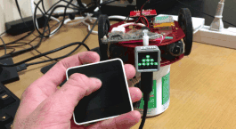

# m5stack_twist_pubsub

- Send and receive Twist messages between M5Stack Core 2 and M5Stack Atom Matrix. There is no need to make a circuit.

## Dependent Libraries

- ros2arduino.h
- WiFi.h
- WiFiUDP.h
- M5Atom.h
- M5Core2.h

## Usage

- Use Arduino IDE.
- Compile and write "[pub_twist_core2.ino](pub_twist_core2/pub_twist_core2.ino) " to M5Stack Core2 .
- Compile and write " [sub_twist_m5atom.ino](sub_twist_m5atom/sub_twist_m5atom.ino) " to M5Stack Atom Matrix.

- Execute `MicroXRCEAgent udp4 --port 2018 `on Ubuntu18.04 (Raspberry Pi4).
- Execute `MicroXRCEAgent udp4 --port 2019 `on Ubuntu18.04 (Raspberry Pi4).

- Reset both M5Stack.

- M5Stack Core2 will be controller of M5Stack Atom Matrix.

## License

Apache License 2.0 : https://github.com/Ar-Ray-code/m5stack_twist_pubsub/blob/main/LICENSE